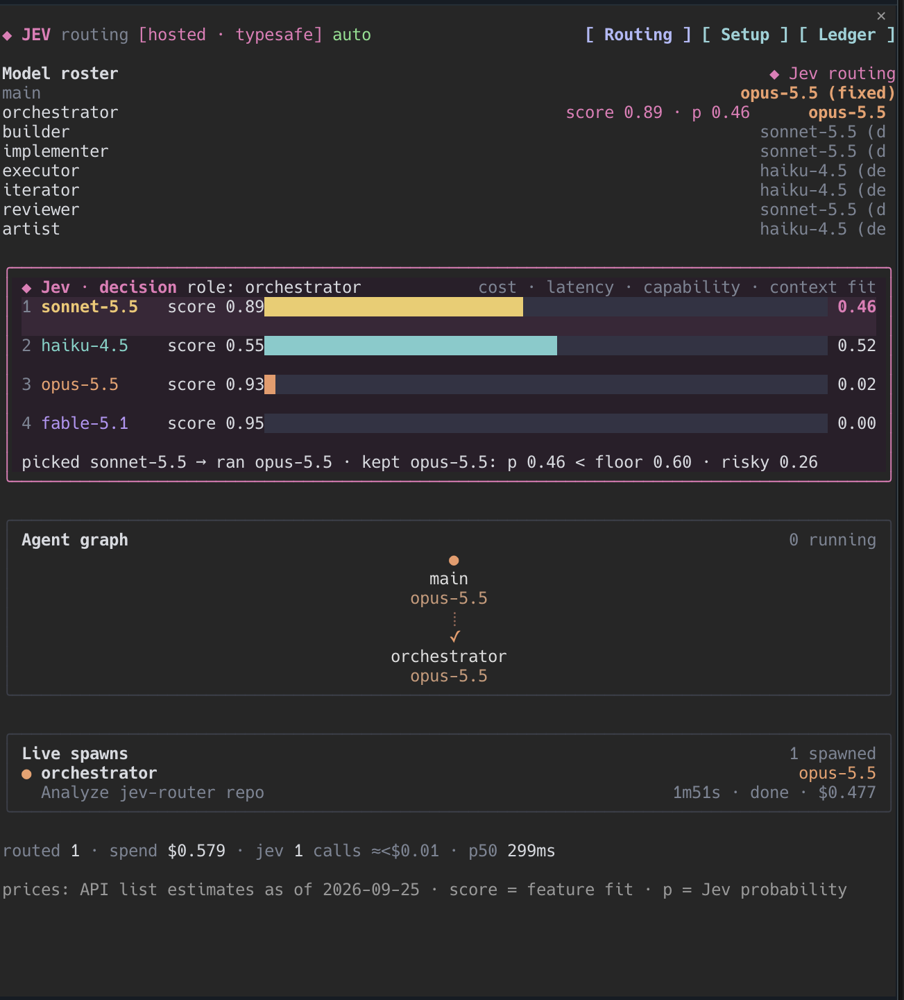
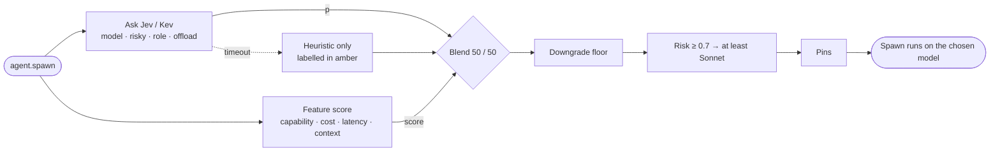

<div align="center">

# ◆ Jev Semaphore

### for Claude Code

**The right model for every subagent: chosen live, shown live.**

A Claude Code mod that lets **Jev** (hosted) or **Kev** (local) pick the model for each subagent spawn,<br>
and hands work that isn't Claude's to do to **Codex**, **OpenCode** and **OpenRouter**.

[](https://claude.com/claude-code)
[](#develop)
[](.claude-plugin/plugin.json)
[](LICENSE)

[Quick start](#quick-start) · [How it works](#how-routing-works) · [Setup](#setup) · [Commands](#commands) · [Develop](#develop)

<br>



</div>

<br>

## ✨ Why

Running every subagent on your main model is the easy default and the expensive one. Running everything on the cheapest model breaks builds. Jev Semaphore sits on `agent.spawn` and decides per spawn:

- 🎯 **Per-task model choice.** Each subagent gets the model its job needs, from Fable and Opus down to Haiku.
- 🛡️ **Guard rails, not guesses.** A downgrade floor, a risk check and per-role pins stop it from cutting corners.
- 👀 **Everything visible.** A live roster, ranked decision bars, an agent graph and a cost ledger show why each model was picked.
- 🔌 **Beyond Claude.** Codex reviews code and generates images, and OpenCode and OpenRouter models take cheap drafting.
- 🧯 **Bounded waits.** The request to Jev is cut off after 3.5 s (6 s for local Kev); after that a transparent heuristic decides and says so.

<br>

<a id="quick-start"></a>

## 🚀 Quick start

> Requires **Claude Code 2.1.289** or newer (function-hook mods).

```sh
claude plugin marketplace add staticdreams/jev-semaphore
claude plugin install jev-semaphore@jev-semaphore
```

Then, inside any Claude Code session:

```text
/jev-semaphore setup      pick a backend, add a key, press "Test connection"
/jev-semaphore            open the routing pane
```

Ask for something multi-part (*"build me an auth page with tests"*) and watch the pane fill in.

<details>
<summary><b>Run from a local checkout instead</b></summary>

```sh
git clone https://github.com/staticdreams/jev-semaphore ~/Projects/jev-semaphore
claude --plugin-dir ~/Projects/jev-semaphore
```

Saving a file hot-reloads the mod.

</details>

<br>

<a id="how-routing-works"></a>

## 🧠 How routing works

Jev and Kev are *decision models*, not routers: you give them a situation and typed questions, and they return probabilities. Jev Semaphore combines those probabilities with its own scores and applies guards before rewriting the spawn's model.



**The questions asked on every spawn:**

| Question | Type | Asked when | Meaning |
|---|---|---|---|
| `model` | choice | always | Which catalog model fits, described by price, context, speed and capability tier |
| `risky` | yes/no | always | Could a mistake cause security problems, data loss or a broken build? |
| `role` | choice | the spawn isn't a jev-semaphore role agent | Which role is this really? |
| `offload` | yes/no | OpenRouter workers are available | Is this bulk generation that a cheap model can draft? |

**Two numbers per candidate**, shown side by side in the pane:

- **score**: the mod's own feature fit, with weights that differ per role.
- **p**: Jev's probability for that model.

**Three guards** are then applied:

| Guard | Rule |
|---|---|
| Downgrade floor | Moving to a cheaper model than the role's default needs `p ≥ downgradeFloor` (default **0.6**). |
| Risk | If `risky ≥ 0.7`, the task runs on at least **sonnet-5.5** (an explicit pin still wins). |
| Pins | `/jev-semaphore pin <role> <model>` fixes a role agent's model. Jev still scores it, but the pin decides. |

If Jev doesn't answer within **3.5 s** (hosted) or **6 s** (Kev), the score alone decides and the decision is labelled `heuristic`; the Jev request is cut off at that point (a little local bookkeeping happens around it). A reply with malformed or out-of-range probabilities is rejected and handled the same way.

<br>

## 🤖 Role agents

Jev Semaphore registers seven subagent types and nudges the main model to delegate to them:

| Agent | Default | Job |
|---|---|---|
| `jev-semaphore:orchestrator` |  | Plan a multi-part job, split it, spawn the others |
| `jev-semaphore:builder` |  | Scaffolding and boilerplate (may draft via OpenRouter) |
| `jev-semaphore:implementer` |  | The substantive feature code |
| `jev-semaphore:executor` |  | Run tests, builds and type checks; report precisely |
| `jev-semaphore:iterator` |  | Fix one failing test or small defect |
| `jev-semaphore:reviewer` |  | Independent review: **Codex first**, then verified |
| `jev-semaphore:artist` |  | Images via **Codex image generation** |

A plain `general-purpose` spawn that Jev classifies as a review or an image job is steered to the reviewer or artist, but only when the matching Codex tool is available.

<br>

## 🖥️ What you see

| Where | What |
|---|---|
| **Pane: Routing** | Model roster (role → score · p → model), the Jev decision card with easing probability bars and the reason a pick was kept or overridden, an agent graph whose running nodes pulse, live spawns with spinners, and spend, Jev calls, estimated Jev cost and a latency sparkline. |
| **Pane: Setup** | Backend selector, key sources (masked), connection test, Kev install/start/stop, and external executor detection with one-line fixes. |
| **Pane: Ledger** | Decision history for the current project only: role, picked model, Jev's numbers, source (Jev, Kev, heuristic or pin) and outcome. Export it to Markdown with `/jev-semaphore export`. |
| **Band above the prompt** | The context exchange: files written, commands run and handoffs appear as nodes, with a packet travelling along the newest edge. Collapse it with `hide`. |
| **Status line** | `◆ jev · hosted · typesafe · auto · 5 routed · $0.42` |
| **Transcript** | One line per decision, e.g. `◆ Jev: builder → haiku-4.5 (score 0.84 · p 0.52)` |

The pane opens at the start of interactive sessions: Claude Code seats it beside the transcript once the terminal is at least 144 columns wide. Open it anywhere with `/jev-semaphore`.

<br>

<a id="setup"></a>

## 🔧 Setup

Everything below is also on the **Setup** tab (`/jev-semaphore setup`).

### 1. Pick a backend

Set it with `/config → jev-semaphore → Routing backend`, or the selector on the Setup tab.

| Backend | What it is | Needs |
|---|---|---|
| `typesafe` | Hosted Jev at `api.typesafe.ai` | TypeSafe API key |
| `openrouter` | Hosted Jev via OpenRouter (`~typesafe/jev-latest`) | OpenRouter API key |
| `kev-local` | Your own Kev server (default `http://127.0.0.1:8009`) | Python 3.12 + `uv` |
| `off` | Heuristic routing only | nothing |

<a id="add-your-key"></a>

### 2. Add your key

Claude Code doesn't list secret fields in `/config`, so Jev Semaphore takes each key from the first source that has it:

1. **Plugin secure config:**
   ```sh
   echo '{"typesafeApiKey":"…"}' | claude plugin configure jev-semaphore@jev-semaphore --values-stdin
   ```
2. **macOS Keychain:** paste the key on the Setup tab and press **Save**. It's stored under the service `jev-semaphore` and passed to `security` over stdin, never on a command line.
3. **1Password:** set `/config → jev-semaphore → TypeSafe key · 1Password ref` to an `op://…` reference. It's read with `op read` when the session starts.
4. **Environment:** `TYPESAFE_API_KEY` or `OPENROUTER_API_KEY`.

The Setup tab shows which source each key came from, with a masked hint. The full key never enters the mod's state or `settings.json`, and error messages are scrubbed of keys and bearer tokens before they are shown or logged.

### 3. Test it

Press **Test connection** or run `/jev-semaphore test` to get the latency and the model version back.

<details>
<summary><b>4. Optional: run Kev locally</b></summary>

<br>

On the Setup tab:

1. **Install** runs `git clone jaredpalmer/kev`, then `uv sync --python 3.12 --extra serve`. Torch has no Python 3.14 wheels yet, so 3.12 is used.
2. **Start** runs Kev detached with `nohup`, so it survives hot reloads. **Stop** only stops the Kev this mod started (it checks the saved process is still `kev.serve`); servers you start by hand are left alone. The log is at `~/.cache/jev-semaphore/kev.log`.
3. The first start downloads `jaredpalmer/<kevModel>` from Hugging Face.

Or from the prompt: `/jev-semaphore kev install | start | stop | status`.

</details>

<details>
<summary><b>5. External executors</b></summary>

<br>

These are detected automatically when a session starts:

| Executor | Used for | Exposed as |
|---|---|---|
| `codex` | Code review; image generation (`codex_image` is only offered when Codex's `image_generation` feature is on) | `codex_review`, `codex_image` |
| `opencode` | Running a task on another model | `opencode_run` |
| OpenRouter | Cheap bulk drafting (only when your key is valid) | `openrouter_draft` |

Every call goes through your Claude Code permission rules first: a denied tool is refused, an allowed one runs, and otherwise you are asked to allow or deny that specific call. With no one to ask, as in a `-p` run, the answer is no.

Anything missing shows a one-line fix on the Setup tab; after fixing it, press **Re-detect** and the newly available tools are registered straight away. Turn individual executors on or off with the `externals` setting.

</details>

<br>

<a id="commands"></a>

## ⌨️ Commands

```text
/jev-semaphore                         open the pane
/jev-semaphore setup | ledger          open a tab
/jev-semaphore test                    probe the backend
/jev-semaphore mode auto|recommend|off this session only (the default lives in /config)
/jev-semaphore pin <role> <model>      fix a role's model
/jev-semaphore unpin <role>            hand it back to Jev
/jev-semaphore kev install|start|stop|status
/jev-semaphore export                  write .jev-semaphore/ledger-<date>.md
```

**Modes:** `auto` applies Jev's pick, `recommend` only shows it, and `off` stops routing. To unload the mod entirely, run `claude plugin disable jev-semaphore@jev-semaphore`.

<details>
<summary><b>All settings (<code>/config → jev-semaphore</code>)</b></summary>

<br>

| Setting | Purpose |
|---|---|
| `backend` | `typesafe` · `openrouter` · `kev-local` · `off` |
| `typesafeApiKey`, `openrouterApiKey` | Secret; see [Add your key](#add-your-key) |
| `typesafeKeyRef`, `openrouterKeyRef` | `op://…` 1Password references, read at session start |
| `kevUrl`, `kevRepoPath`, `kevModel`, `kevAutostart` | Local Kev server: URL, checkout path, checkpoint size, autostart |
| `routingMode` | Default mode: `auto` · `recommend` · `off` |
| `downgradeFloor` | How sure Jev must be (0–1) before a role moves to a cheaper model (default 0.6) |
| `budgetUsd` | Soft per-session spend cap, shown as a gauge (not enforced); `0` turns it off |
| `externals` | Comma-separated: `codex-review`, `codex-image`, `opencode`, `openrouter` |
| `openrouterModels` | Comma-separated OpenRouter model slugs offered as cheap workers |

</details>

<br>

## 📏 Honest numbers

- Prices are Anthropic API list prices **as of 2026-10-04**, labelled as estimates. Cache hits use each model's published rate and 5-minute cache writes 1.25× input; 1-hour cache writes are not distinguished.
- The capability tier is this mod's heuristic, not a benchmark. SWE-bench stays `unknown` until a dated, sourced figure is added to `hooks/lib/catalog.ts`.
- The Jev/Kev call cost uses the $0.04/MTok input price quoted for OpenRouter's listing, shown with `≈`.
- Codex, OpenCode and OpenRouter costs are not estimated.

<br>

<a id="develop"></a>

## 🛠️ Develop

```sh
claude --plugin-dir .        # load from this checkout; saving a file hot-reloads the mod
claude plugin validate .     # manifest + what the module hooks and calls
claude plugin test .         # tests/*.test.ts against the engine
tsc -p .                     # after Claude Code has loaded the mod once
```

<details>
<summary><b>Project layout</b></summary>

```text
.claude-plugin/
  plugin.json          manifest + userConfig (the /config rows)
  marketplace.json     marketplace entry
types/index.d.ts       $.state contract
hooks/
  register.tsx         every hook; the only file that holds `$`
  lib/
    router.ts          scoring, questions for Jev, guards
    jev-client.ts      endpoint selection, timed request, reply parsing
    externals.ts       Codex / OpenCode / OpenRouter + managed Kev
    agents.ts          role-agent specs and the system-prompt section
    catalog.ts         models, prices, capability tiers
    host.ts            the interface library code gets instead of `$`
    state.ts, theme.ts empty states, ledger type, colours, formatters
  ui/
    pane.tsx           Routing, Setup and Ledger tabs
    band.tsx           context-exchange band above the prompt
    raster.ts, svg.ts  terminal cell grids + braille, desktop SVG
    anim.ts            frame loop for the bars and packets
tests/                 router + session tests
```

</details>

**Rules of the codebase:**

- `$` (the engine interface) may only be used inside `hooks/register.tsx`, and `claude plugin validate` enforces this. Library code gets a small `Host` built from it (`hooks/lib/host.ts`), and the renderers get plain data and callbacks.
- `tsconfig.json` extends `.claude-plugin/types/tsconfig.json`. Claude Code writes that file, along with its API declarations, every time it loads the mod, and it's git-ignored. So load the mod once with `--plugin-dir` before running `tsc`.

<br>

## 📄 License

[MIT](LICENSE) © Peter

<div align="center">
<sub>Built as a Claude Code function-hook mod · ◆ signalled by Jev</sub>
</div>
